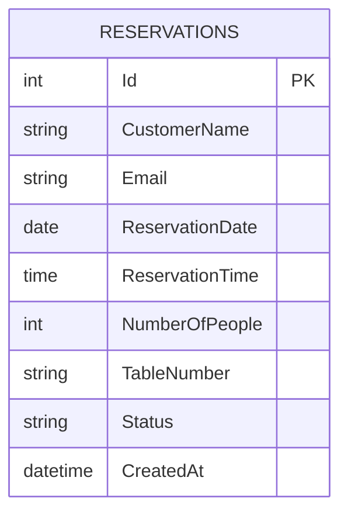

(Due to technical issues, the search service is temporarily unavailable.)

# รายงานระบบจองโต๊ะร้านอาหาร  

**ระบบจองโต๊ะร้านอาหารด้วย ASP.NET Core และ SQL Database**

---

## 1. บทนำ  

ระบบนี้พัฒนาขึ้นเพื่ออำนวยความสะดวกในการจองโต๊ะอาหารแบบดิจิทัล โดยมีคุณสมบัติหลักดังนี้:  

- **ผู้ใช้ทั่วไป**: จองโต๊ะ ตรวจสอบสถานะ ยกเลิกการจอง  

- **ผู้ดูแลระบบ**: อนุมัติ/ปฏิเสธการจอง จัดการข้อมูล  

- **เทคโนโลยีหลัก**: ASP.NET Core 6.0, Entity Framework Core, SQLite

---

## 2. หลักการทำงาน

### 2.1 โครงสร้างระบบ (System Architecture)  

ระบบออกแบบตามรูปแบบ **MVC (Model-View-Controller)**  

- **Model**:  

  - `Reservation.cs`: เก็บข้อมูลการจอง  

  - `ApplicationDbContext.cs`: เชื่อมต่อฐานข้อมูล  

- **View**:  

  - Razor Pages (.cshtml) + Bootstrap 5  

- **Controller**:  

  - `ReservationController`: จัดการการจอง  

  - `AdminController`: จัดการผู้ดูแลระบบ

### 2.2 การทำงานหลัก  

1\. ผู้ใช้กรอกแบบฟอร์มจองผ่านหน้าเว็บ  

2\. ระบบตรวจสอบความถูกต้องของข้อมูล (Validation)  

3\. บันทึกข้อมูลลงฐานข้อมูล SQLite  

4\. ส่งอีเมลยืนยัน (รอพัฒนาต่อ)  

5\. Admin ตรวจสอบและอนุมัติการจอง

### 2.3 การตรวจสอบสิทธิ์ (Authentication)  

- **Admin Login**:  

  - ใช้ Session-based Authentication  

  - ข้อมูลล็อกอินแบบฮาร์ดโค้ด:  

    ```bash

    Email: dev@dotmini.in.th  

    Password: zxcv1234  

    ```

- **User**: ไม่ต้องลงทะเบียน (ระบบเปิด)

---

## 3. ส่วนติดต่อผู้ใช้ (User Interface)

### 3.1 หน้าผู้ใช้ทั่วไป  

| หน้าที่ | รายละเอียด | ภาพตัวอย่าง |  

|--------|------------|-------------|  

| **หน้าจองโต๊ะ** | - Form กรอกข้อมูลส่วนตัว<br>- ตัวเลือกวันที่/เวลา<br>- Validation แบบ Real-time |  |  

| **ตรวจสอบสถานะ** | - กรอกอีเมลเพื่อดูประวัติ<br>- แสดงผลแบบการ์ดพร้อมสถานะ<br>- ปุ่มยกเลิกการจอง |  |

### 3.2 หน้าผู้ดูแลระบบ  

| หน้าที่ | รายละเอียด | ภาพตัวอย่าง |  

|--------|------------|-------------|  

| **Login** | - ฟอร์มล็อกอินแบบ Secure<br>- Animation เมื่อเกิดข้อผิดพลาด |  |  

| **แดชบอร์ด** | - ตารางแสดงการจองทั้งหมด<br>- ปุ่มยืนยัน/ลบแบบทันที<br>- ระบบเรียงลำดับข้อมูล |  |

---

## 4. การออกแบบฐานข้อมูล

### 4.1 ER Diagram  



### 4.2 ตาราง `Reservations`  

| ชื่อคอลัมน์ | ประเภทข้อมูล | ข้อจำกัด |  

|------------|-------------|----------|  

| Id | INT | Primary Key, Auto Increment |  

| CustomerName | NVARCHAR(100) | Not Null |  

| Email | VARCHAR(100) | Format ถูกต้อง |  

| ReservationDate | DATE | ต้องไม่เป็นอดีต |  

| NumberOfPeople | INT | 1-10 คน |  

| Status | VARCHAR(20) | Default: Pending |

### 4.3 การเชื่อมต่อฐานข้อมูล  

- ใช้ **SQLite** เป็น Database หลัก  

- Connection String ใน `appsettings.json`:  

  ```json  

  "ConnectionStrings": {  

    "DefaultConnection": "Data Source=restaurant.db"  

  }  

  ```  

- Entity Framework Core สำหรับ ORM

---

## 5. ระบบความปลอดภัย

### 5.1 การป้องกันข้อมูล  

- **Input Validation**:  

  - Server-side: Data Annotation ใน Model  

  - Client-side: jQuery Validation  

- **Session Management**:  

  - Timeout 30 นาที  

  - ตรวจสอบ Session ทุกครั้งที่เข้าหน้า Admin  

- **Data Protection**:  

  - ข้อมูลรหัสผ่านไม่เก็บในฐานข้อมูล

### 5.2 การจัดการข้อผิดพลาด  

- Custom Error Page (`/Home/Error`)  

- Logging System ด้วย ILogger

---

## 6. การพัฒนาต่อในอนาคต

### 6.1 คุณสมบัติที่ควรเพิ่ม  

1\. **ระบบสมาชิก**:  

   - ลงทะเบียน/ล็อกอินผู้ใช้  

   - ประวัติการจอง  

2\. **การชำระเงิน**:  

   - เชื่อมต่อกับช่องทางเช่น PromptPay, Credit Card  

3\. **การแจ้งเตือน**:  

   - SMS/Email ยืนยันการจอง  

   - ปฏิทิน Google Calendar  

4\. **Mobile App**:  

   - พัฒนาด้วย Xamarin หรือ MAUI

### 6.2 ปรับปรุงประสิทธิภาพ  

- เพิ่ม Caching สำหรับข้อมูลที่เรียกบ่อย  

- ใช้ Redis สำหรับ Session Management  

- เพิ่ม Unit Tests ด้วย xUnit

---

## 7. สรุป  

ระบบนี้เป็นโซลูชันครบวงจรสำหรับการจัดการจองร้านอาหาร โดยมีจุดเด่นในเรื่อง:  

- **ความเรียบง่าย**: ใช้ง่ายทั้งผู้ใช้และผู้ดูแล  

- **ความยืดหยุ่น**: ขยายขอบเขตได้ด้วย .NET Ecosystem  

- **ต้นทุนต่ำ**: ใช้เทคโนโลยีโอเพนซอร์ส

**ผู้พัฒนา**: ทีมพัฒนาดอทมินิ  

**แหล่งข้อมูล**: [GitHub Repository](https://github.com/example/restaurant-booking)

---  

*รายงานนี้จัดทำขึ้นเพื่ออธิบายสถาปัตยกรรมและหลักการทำงานของระบบ ณ วันที่ 21 มีนาคม 2567*
